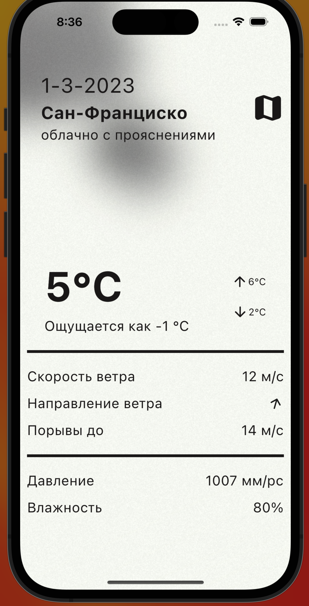
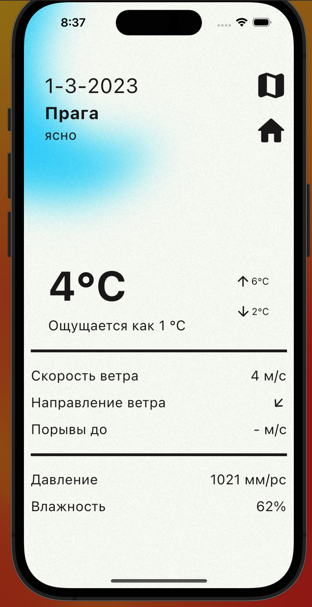
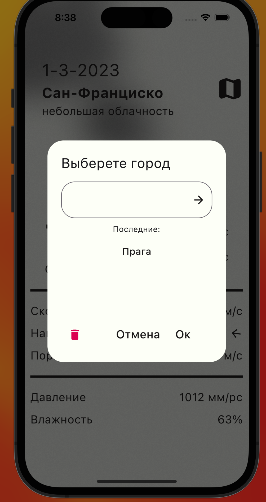

# weather_app2

### Это моя вторая попытка сделать приложение взаимодействующее с сетью

---

## Были реализован следующий функционал

1) Получение геолокации пользователя и выдача погоды в месте его нахождения.

2)  Просмотр погоды в других городах.

3) Хранение истории поиска с помощью Hive.

